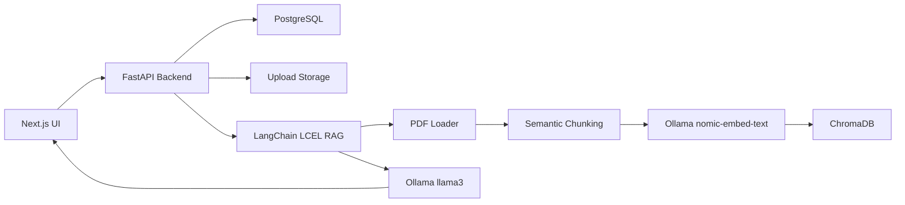

# Enterprise AI PDF Chat / RAG Assistant

Production-ready local PDF question-answering app with FastAPI, Next.js, PostgreSQL, ChromaDB, LangChain LCEL, Ollama models, JWT auth, streaming, citations, and Docker deployment.

## Features

- Multi-PDF upload with validation, storage, and background ingestion
- PDF parsing with page metadata
- Local Ollama embeddings and configurable chat model
- Recursive chunking optimized for local embeddings, with optional semantic chunking
- Persistent ChromaDB vector store with metadata filtering
- RAG answers with citations and source previews
- Session-based multi-turn chat history with frontend session reload
- REST APIs plus SSE and WebSocket streaming
- JWT authentication and Argon2 password hashing
- PostgreSQL models for users, sessions, messages, and documents
- Structured logging, request logging, rate limiting, caching, and Sentry hook
- Next.js frontend with responsive chat, uploads, dark mode, markdown, and toasts
- Docker Compose, GitHub Actions, and deployment configs

## Architecture



## Quick Start

```bash
ollama pull llama3
ollama pull nomic-embed-text
cp .env.example .env
cp backend/.env.example backend/.env
cp frontend/.env.example frontend/.env.local
docker compose up --build
```

Ollama must be running on the host at `http://host.docker.internal:11434` for Docker, or `http://localhost:11434` when running the backend directly.

- Frontend: `http://localhost:3000`
- Backend docs: `http://localhost:8000/docs`
- Health: `http://localhost:8000/api/v1/health`

## Environment Variables

Backend:

- `DATABASE_URL`
- `SECRET_KEY`
- `OLLAMA_BASE_URL`
- `OLLAMA_CHAT_MODEL`
- `OLLAMA_EMBEDDING_MODEL`
- `OLLAMA_REQUEST_TIMEOUT_SECONDS`
- `OLLAMA_NUM_CTX`
- `OLLAMA_KEEP_ALIVE`
- `BACKEND_CORS_ORIGINS`
- `CHROMA_COLLECTION_NAME`
- `CHROMA_PERSIST_DIR`
- `UPLOAD_DIR`
- `CACHE_TTL_SECONDS`

Frontend:

- `NEXT_PUBLIC_API_URL`

## API Summary

- `POST /api/v1/auth/register`
- `POST /api/v1/auth/login/json`
- `POST /api/v1/upload`
- `POST /api/v1/chat`
- `POST /api/v1/chat/stream`
- `GET /api/v1/history`
- `DELETE /api/v1/documents`
- `GET /api/v1/health`
- `GET /api/v1/health/ready`

The backend also mounts the same core endpoints without `/api/v1` for simple local testing.

## Local Development

Backend:

```bash
cd backend
python -m venv .venv
.venv\Scripts\activate
pip install -r requirements.txt
uvicorn app.main:app --reload
```

For direct local backend development, set `OLLAMA_BASE_URL=http://localhost:11434`.

Frontend:

```bash
cd frontend
npm install
npm run dev
```

## Tests and Quality

```bash
cd backend
pytest
ruff check app tests

cd ../frontend
npm run lint
npm run typecheck
npm run build
```

The backend suite covers auth, health, upload validation, and chat persistence with a mocked RAG pipeline.

## Screenshots

Add screenshots to `docs/screenshots/` after running the app:

- Dashboard
- Upload workflow
- Streaming chat with citations
- Dark mode

## Deployment

Deployment guides and config live in:

- `render.yaml`
- `railway.json`
- `vercel.json`
- `deploy/aws-ec2/docker-compose.prod.yml`
- `docs/DEPLOYMENT.md`

Docker builds use `.dockerignore` files to keep local virtualenvs, build output, node modules, storage, and databases out of images.

## Future Improvements

- Alembic migrations
- Redis-backed rate limits and cache
- Object storage for uploaded PDFs
- OCR for scanned PDFs
- Reranking model for retrieval quality
- Admin dashboard and audit exports
- Evaluation suite with retrieval metrics
