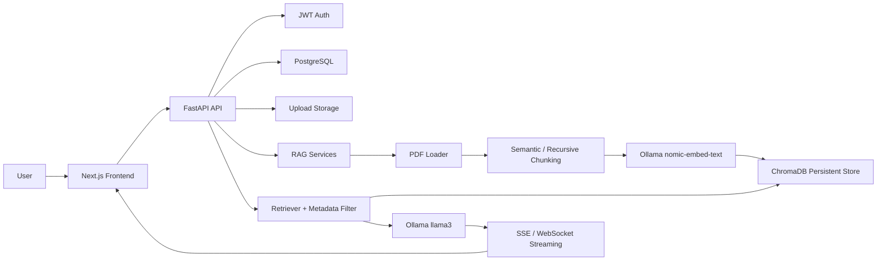

# Architecture

## Backend Layers

- `api`: FastAPI routes and dependency injection.
- `services`: user, document, and chat orchestration.
- `rag`: PDF loading, chunking, vector-store access, retrieval, LCEL prompt chain.
- `models`: SQLAlchemy persistence models.
- `schemas`: Pydantic request and response contracts.
- `middleware`: request logging, rate limiting, and error handling.

## Data Flow

1. A user uploads PDFs through the protected upload endpoint.
2. Files are validated, stored, and recorded in PostgreSQL.
3. A background task extracts page text, chunks it, embeds chunks with local Ollama, and stores vectors in ChromaDB with metadata.
4. Chat requests retrieve the top matching chunks, build a grounded prompt, and stream the answer.
5. Messages, sessions, citations, and document state are persisted for auditability.
6. The frontend can reload previous sessions from persisted history and continue the conversation.

## Production Notes

- The default app auto-creates tables to make `docker-compose up` work immediately.
- Add Alembic migrations before team production use.
- Replace the in-memory rate limiter/cache with Redis for multi-instance deployments.
- Store uploads and Chroma persistence on durable volumes or object storage.
- Streaming endpoints emit structured error events so clients can fail gracefully.
- Docker uses `host.docker.internal` plus `extra_hosts` so the backend container can reach Ollama running on the host.
